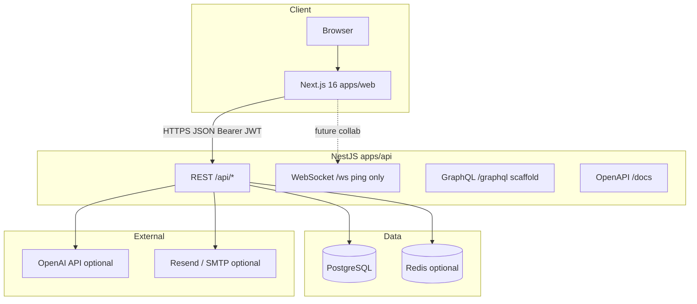
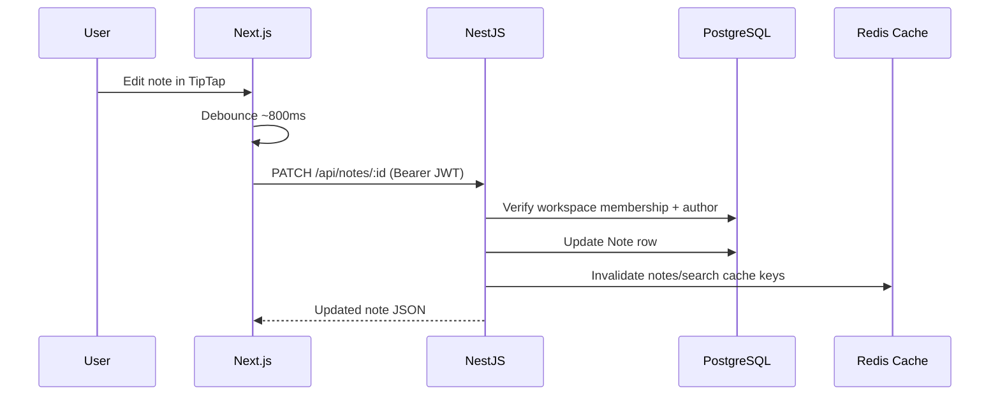

# Peblo InfinityOS — Project Disclosure & Technical Overview

**Document version:** 1.0  
**Last updated:** May 2026  
**Repository:** `peblo-infinityos` (TypeScript monorepo)  
**Purpose:** A complete, honest description of what was built, how it works, and what remains — for investors, partners, interviewers, auditors, or future collaborators.

---

## Table of contents

1. [Executive summary](#1-executive-summary)  
2. [Product vision & positioning](#2-product-vision--positioning)  
3. [What is shipped today](#3-what-is-shipped-today)  
4. [System architecture](#4-system-architecture)  
5. [Repository structure](#5-repository-structure)  
6. [Technology stack](#6-technology-stack)  
7. [Data model (database)](#7-data-model-database)  
8. [Backend (NestJS API) — deep dive](#8-backend-nestjs-api--deep-dive)  
9. [Frontend (Next.js) — deep dive](#9-frontend-nextjs--deep-dive)  
10. [Security & access control](#10-security--access-control)  
11. [Infrastructure, caching & queues](#11-infrastructure-caching--queues)  
12. [Deployment & operations](#12-deployment--operations)  
13. [Local development](#13-local-development)  
14. [What is intentionally not built yet](#14-what-is-intentionally-not-built-yet)  
15. [Future roadmap (stages)](#15-future-roadmap-stages)  
16. [How to present / demo this project](#16-how-to-present--demo-this-project)  
17. [Frequently asked questions](#17-frequently-asked-questions)  
18. [Appendix: API reference](#18-appendix-api-reference)  
19. [Appendix: Environment variables](#19-appendix-environment-variables)

---

## 1. Executive summary

**Peblo InfinityOS** is a full-stack SaaS-style web application aimed at **learning, productivity, startups, and creator workflows**. It is implemented as a **production-oriented MVP** on a modern TypeScript stack:

| Layer | Technology |
|-------|------------|
| Web client | Next.js 16 (App Router), React 19, Tailwind CSS 4 |
| API | NestJS 11 (REST-first), optional GraphQL & WebSocket scaffolds |
| Database | PostgreSQL via Prisma ORM 5 |
| Optional infra | Redis (cache + BullMQ mail queue) |

**What works end-to-end today:**

- User registration and login with JWT sessions  
- Multi-workspace accounts (personal workspace created on signup)  
- Rich-text notes (TipTap editor, debounced autosave, search, tags)  
- Public read-only note sharing via unguessable tokens  
- Task management (CRUD, Kanban-style UI, assignees)  
- AI note summarization with usage quotas and request history  
- Workspace-wide keyword search (notes + tasks) with Ctrl+K UI  
- Password reset flow with production email (Resend or SMTP)  
- Workspace productivity insights API  
- Marketing landing page, pricing page, settings/profile  
- One-command production deploy via Docker Compose  

**What exists only as schema or stubs:** real-time collaborative editing (Yjs), flashcards/quizzes, marketplace, billing/Stripe, RAG/vector search, OAuth/SSO/2FA, and several enterprise features.

This document describes **both** what was built and what was deliberately deferred, so disclosures stay accurate.

---

## 2. Product vision & positioning

### 2.1 Problem space

Knowledge workers, learners, and small teams need a single place to:

- Capture and organize notes  
- Plan work (tasks, deadlines, assignees)  
- Use AI on their own content (summaries today; Q&A/RAG later)  
- Eventually collaborate in real time, sell templates/courses, and adopt enterprise security  

### 2.2 Product framing

InfinityOS is framed as an **“operating system” for work and learning** — not a single feature app. The **long-term roadmap** spans:

1. **Foundation** — auth, workspaces, notes, tasks *(largely complete)*  
2. **AI layer** — summarize, logs, quotas *(MVP complete)*; RAG *(planned)*  
3. **Collaboration** — WebSocket + Yjs *(stub only)*  
4. **Learning** — flashcards, quizzes, courses *(schema only)*  
5. **Marketplace & billing** — Stripe, subscriptions *(schema only)*  
6. **Enterprise** — SSO, 2FA, org policies *(planned)*  

### 2.3 Design philosophy in code

- **Schema-first:** Prisma models exist for future modules so migrations stay additive.  
- **Bounded contexts:** Each domain (auth, notes, tasks, ai, search) is a NestJS module.  
- **Honest MVP:** Features are shipped with membership checks, throttling, and logging before marketing claims expand.  
- **Graceful degradation:** Redis, OpenAI, and mail transports are optional; the app runs without them in development.

---

## 3. What is shipped today

### 3.1 Feature matrix

| Module | Status | User-visible behavior |
|--------|--------|------------------------|
| **Authentication** | Shipped | Register, login, JWT, profile update (name, avatar URL), change password |
| **Password reset** | Shipped | Forgot/reset password; email via Resend/SMTP in production; dev exposes reset URL |
| **Workspaces** | Shipped (MVP) | Auto-created on signup; switcher in dashboard; list members; insights API |
| **Notes** | Shipped | CRUD, TipTap rich text, autosave, sidebar search, tag filter, tag editing |
| **Public share** | Shipped | Generate/revoke share link; public page `/p/[token]` (read-only, rate-limited) |
| **Tasks** | Shipped | CRUD, status columns, assignee picker (from workspace members) |
| **AI summarize** | Shipped | Summarize note; OpenAI when key set, else deterministic offline text |
| **AI hub** | Shipped | Usage quota display, paginated AiLog history, log detail view |
| **Global search** | Shipped | `GET /api/search`; Ctrl+K palette; deep-links to notes/tasks |
| **Redis cache** | Shipped (optional) | Caches search, notes list, AI usage when `REDIS_URL` set |
| **Mail queue** | Shipped (optional) | BullMQ `mail` queue when Redis configured |
| **Landing & marketing** | Shipped | Custom landing (not generic AI template); pricing page |
| **Deploy pack** | Shipped | `docker-compose.prod.yml`, Dockerfiles, `npm run deploy` |
| **Collaboration (Yjs)** | Not shipped | WebSocket gateway only responds to `ping` → `pong` |
| **Learning** | Not shipped | `Flashcard`, `Quiz`, `Course` tables unused |
| **Marketplace** | Not shipped | `MarketplaceProduct` table unused |
| **Billing** | Not shipped | `Subscription` + Stripe fields unused |
| **RAG / semantic search** | Not shipped | Keyword search only |
| **OAuth / SSO / 2FA** | Not shipped | Env placeholders only |
| **Workspace invites** | Not shipped | Roles exist in DB; no invite API/UI |

### 3.2 Demo account

A seeded demo user allows instant evaluation without registration:

| Field | Default |
|-------|---------|
| Email | `demo@peblo.infinityos.app` |
| Password | `DemoInfinity2026!` |

Seed also creates sample notes in a demo workspace. Credentials are configurable via `DEMO_*` environment variables and `npm run db:seed`.

---

## 4. System architecture

### 4.1 High-level diagram



### 4.2 Request flow (authenticated note save)



### 4.3 Monorepo layout

```
peblo-infinityos/
├── apps/
│   ├── web/          # Next.js frontend
│   └── api/          # NestJS backend + Prisma
├── scripts/          # deploy, start-dev (embedded Postgres), setup
├── docker-compose.yml           # Dev: Postgres + Redis
├── docker-compose.prod.yml      # Prod: Postgres + Redis + API + Web
├── DEPLOY.md                    # Deploy instructions
├── README.md                    # Engineer onboarding (partially outdated — see this doc)
└── PROJECT_DISCLOSURE.md        # This file
```

**Package manager:** npm workspaces (`apps/web`, `apps/api`).

---

## 5. Repository structure

### 5.1 Backend (`apps/api/src/`)

| Path | Responsibility |
|------|----------------|
| `auth/` | Register, login, JWT, profile, password reset, change password |
| `workspaces/` | List workspaces, members, productivity insights |
| `notes/` | Note CRUD, sharing, membership/author checks |
| `notes/public-notes.controller.ts` | Unauthenticated read by share token |
| `tasks/` | Task CRUD with workspace scoping |
| `ai/` | Summarize, usage quota, AiLog list/detail |
| `search/` | Unified keyword search across notes and tasks |
| `mail/` | Resend + SMTP password-reset emails |
| `redis/` | ioredis connection wrapper |
| `cache/` | JSON cache get/set with TTL |
| `queue/` | BullMQ mail processor |
| `collaboration/` | WebSocket gateway (ping/pong placeholder) |
| `graphql/` | Apollo scaffold |
| `health/` | Liveness + redis/cache status |
| `prisma/` | Schema, migrations, seed |

### 5.2 Frontend (`apps/web/src/`)

| Path | Responsibility |
|------|----------------|
| `app/page.tsx` | Marketing landing |
| `app/auth/*` | Login, register, forgot/reset password |
| `app/dashboard/*` | Authenticated shell: overview, notes, tasks, AI, settings |
| `app/p/[token]/page.tsx` | Public shared note viewer |
| `app/pricing/page.tsx` | Pricing/marketing |
| `components/notes-workspace.tsx` | TipTap editor, list, search, tags, share, AI summarize |
| `components/tasks-workspace.tsx` | Kanban task board |
| `components/ai-hub-workspace.tsx` | AI usage + log history |
| `components/global-search.tsx` | Ctrl+K search modal |
| `components/dashboard-shell.tsx` | Sidebar, workspace switcher, nav |
| `components/landing-page.tsx` | Product marketing layout |
| `stores/auth-store.ts` | Zustand session (user, tokens, workspaces) |
| `lib/api-client.ts` | Fetch wrapper with Bearer token |

---

## 6. Technology stack

### 6.1 Web (`apps/web`)

| Category | Choice | Role |
|----------|--------|------|
| Framework | Next.js 16.2 | App Router, SSR/SSG for marketing |
| UI | React 19, Tailwind CSS 4 | Components and styling |
| Components | shadcn/ui patterns, Lucide icons | Consistent UI primitives |
| Editor | TipTap 3 + StarterKit | Rich-text notes |
| State | Zustand (auth), TanStack Query (server data) | Client session + API caching |
| Motion | Framer Motion | Subtle UI motion on marketing/dashboard |
| Themes | next-themes | Light/dark mode |

### 6.2 API (`apps/api`)

| Category | Choice | Role |
|----------|--------|------|
| Framework | NestJS 11 | Modular HTTP API |
| ORM | Prisma 5.22 | Type-safe PostgreSQL access |
| Auth | passport-jwt, bcrypt | JWT bearer + password hashing (cost 12) |
| Validation | class-validator DTOs | Request validation |
| Docs | Swagger at `/docs` | Interactive API documentation |
| Rate limit | @nestjs/throttler | Global 120 req/min; stricter on AI routes |
| Queue | BullMQ + Redis | Async password-reset email |
| WebSocket | `@nestjs/platform-ws` | Scaffold for future Yjs |
| GraphQL | Apollo | Scaffold (not primary client path) |

### 6.3 Data & ops

| Category | Choice |
|----------|--------|
| Database | PostgreSQL 16 |
| Cache/queue | Redis 7 (optional in dev, enabled in prod compose) |
| Containers | Docker Compose for dev DB and full prod stack |
| CI | GitHub Actions workflow (`.github/workflows/ci.yml`) |

---

## 7. Data model (database)

Prisma schema is the **canonical domain contract** (`apps/api/prisma/schema.prisma`).

### 7.1 Core entities (actively used)

| Model | Purpose |
|-------|---------|
| `User` | Account; `email`, `passwordHash`, `name`, `avatarUrl`, `emailVerified` (field exists, verify flow not wired) |
| `Workspace` | Tenant boundary; `name`, `slug`, `type` (PERSONAL, TEAM, STARTUP, LEARNING, CREATOR) |
| `WorkspaceMember` | User ↔ workspace with `WorkspaceRole` (OWNER, ADMIN, MEMBER, VIEWER) |
| `Note` | Rich content, tags, optional `shareToken`, optional `parentId` (hierarchy not exposed in UI) |
| `Task` | Title, description, `TaskStatus`, `dueAt`, `assigneeId`, `position` |
| `AiLog` | AI request audit: `model`, `prompt`, `response`, `tokens` |

### 7.2 Entities reserved for future modules (no API/UI yet)

| Model | Planned use |
|-------|-------------|
| `Flashcard` | Spaced repetition (`ease`, `interval`, `dueAt`) |
| `Quiz` | JSON `payload` for assessments |
| `Course` | Curriculum JSON, published flag |
| `MarketplaceProduct` | Seller listings, `priceCents`, `type` |
| `Subscription` | SaaS tiers, Stripe IDs |
| `Notification` | In-app notifications |
| `InvestorContact` | Startup CRM |
| `AnalyticsEvent` | Product analytics pipeline |

### 7.3 Migrations applied

1. `20260514183000_init` — full initial schema  
2. `20260515120000_note_share_token` — public sharing on `Note.shareToken`

---

## 8. Backend (NestJS API) — deep dive

**Base URL:** `http://localhost:4000/api` (development)  
**Global prefix:** `/api`  
**OpenAPI:** `http://localhost:4000/docs`

### 8.1 Authentication module

**Registration (`POST /api/auth/register`)**

1. Validates email/password/name.  
2. Hashes password with bcrypt (12 rounds).  
3. Creates `User` + `Workspace` + `WorkspaceMember` (role OWNER) in one transaction.  
4. Returns user profile, workspace list, `accessToken`, `refreshToken`.

**Login (`POST /api/auth/login`)**

- Validates credentials; returns same token shape as register.

**Session (`GET /api/auth/me`)**

- JWT required; returns user + all workspaces the user belongs to.

**Profile (`PATCH /api/auth/me`)**

- Updates `name` and/or `avatarUrl` (HTTPS URLs only for avatar).

**Password reset**

- `POST /api/auth/forgot-password` — creates time-limited reset token (JWT).  
  - **Production:** sends email via `MailService` (Resend API or SMTP).  
  - **Development:** can return `resetUrl` in JSON when not in production or when `PASSWORD_RESET_EXPOSE_TOKEN=1`.  
- `POST /api/auth/reset-password` — accepts token + new password.

**Change password (`POST /api/auth/change-password`)**

- Requires current password while authenticated.

**JWT configuration**

- Access and refresh secrets via `JWT_ACCESS_SECRET`, `JWT_REFRESH_SECRET`.  
- Expiry configurable (`JWT_ACCESS_EXPIRES`, `JWT_REFRESH_EXPIRES`).

### 8.2 Workspaces module

| Endpoint | Behavior |
|----------|----------|
| `GET /api/workspaces/mine` | All memberships for current user |
| `GET /api/workspaces/:id/members` | Member list (for task assignees) |
| `GET /api/workspaces/:id/insights` | Rollup: note counts, shared notes, task status breakdown, overdue/due soon, per-assignee workload |

Every endpoint verifies **workspace membership** before returning data.

### 8.3 Notes module

**Authorization rules**

- **Read/list:** any workspace member.  
- **Create:** member provides `workspaceId`.  
- **Update/delete/share:** note **author** only (for mutations).

**Features**

- List with optional `q` (title + content, case-insensitive) and `tag` (exact tag in array).  
- Rich text stored as HTML string (`NoteFormat.RICH`).  
- Share: `POST /api/notes/:id/share` generates stable or regenerated `shareToken`.  
- Public: `GET /api/public/notes/:token` — no auth, throttled, returns title/content/format/updatedAt only.

**Cache invalidation**

- On note create/update/delete, cache keys for that workspace’s notes list and search are cleared.

### 8.4 Tasks module

- Full CRUD scoped by `workspaceId`.  
- Any **member** may update tasks (not only author) — suitable for team boards.  
- Status enum: `TODO`, `IN_PROGRESS`, `DONE`, `BLOCKED`.  
- Optional `assigneeId` must be a user in the same workspace.

### 8.5 AI module

**Summarize (`POST /api/ai/summarize`)**

- Body: `{ noteId }`.  
- Verifies note access via workspace membership.  
- If `OPENAI_API_KEY` is set: calls OpenAI (`gpt-4o-mini`) with truncated note content.  
- Else: returns a structured offline demo summary (no external call).  
- Persists row in `AiLog` with prompt, response, token count.  
- **Quota:** rolling 24-hour window; default limit 50 requests/user (`AI_DAILY_REQUEST_LIMIT`). Exceeding returns HTTP 429.

**Usage (`GET /api/ai/usage`)**

- Returns `usedLast24h`, `limit`, `remaining`, `windowHours`.  
- Cached briefly when Redis enabled.

**Logs (`GET /api/ai/logs`, `GET /api/ai/logs/:id`)**

- Cursor-based pagination for history.  
- List returns previews; detail returns full prompt/response for the owning user only.

### 8.6 Search module

**`GET /api/search?workspaceId=&q=&limit=`**

- Membership check.  
- Parallel Prisma queries on notes (title, content) and tasks (title, description).  
- Returns typed results with **snippets** (context around match).  
- Response cached 60 seconds per workspace/query/limit when Redis enabled.

### 8.7 Mail & queue module

**`MailService`**

- Resend HTTP API **or** nodemailer SMTP.  
- Requires `MAIL_FROM` when sending.  
- Used for password-reset emails.

**`MailQueueService` + `MailProcessor`**

- When `REDIS_URL` is set, forgot-password enqueues BullMQ job `send-password-reset`.  
- Without Redis, sends synchronously in the request thread.

### 8.8 Health module

**`GET /api/health`**

```json
{
  "status": "ok",
  "service": "peblo-infinityos-api",
  "redis": "disabled | up | down",
  "cache": false,
  "mailQueue": false
}
```

Used for deploy probes and monitoring.

### 8.9 Collaboration module (placeholder)

- WebSocket path: `/ws`  
- Only handles `ping` → `pong`  
- **No** Yjs document sync, presence, or room authorization yet.

### 8.10 GraphQL module (scaffold)

- Apollo Server mounted; minimal resolver.  
- **Primary client integration uses REST**, not GraphQL.

---

## 9. Frontend (Next.js) — deep dive

**Dev URL:** `http://localhost:3000`

### 9.1 Public routes

| Route | Description |
|-------|-------------|
| `/` | Landing page: product story, architecture snippet, roadmap section, CTA to register |
| `/pricing` | Pricing tiers (marketing; billing not wired) |
| `/auth/login` | Login + optional demo pre-fill (`?demo=1`) |
| `/auth/register` | New account |
| `/auth/forgot-password` | Request reset link |
| `/auth/reset-password` | Set new password from email link |
| `/p/[token]` | Public read-only shared note |

### 9.2 Dashboard routes (protected)

`dashboard-auth-gate.tsx` redirects unauthenticated users to login.

| Route | Component | Behavior |
|-------|-----------|----------|
| `/dashboard` | Overview | Workspace summary / entry tiles |
| `/dashboard/notes` | `NotesWorkspace` | Editor, list, search, tags, share link, AI summarize button |
| `/dashboard/tasks` | `TasksWorkspace` | Kanban columns, create/edit tasks, assignees |
| `/dashboard/ai` | `AiHubWorkspace` | Quota meter, paginated AI history |
| `/dashboard/settings` | Settings page | Profile name/avatar, change password |

### 9.3 Dashboard shell

- **Workspace switcher** — changes `currentWorkspaceId` in Zustand; all data queries key off it.  
- **Global search** — Ctrl+K (Cmd+K on Mac) opens modal; calls `/api/search`; navigates to notes/tasks with query hints.  
- **Theme toggle** — light/dark.  
- **Logout** — clears auth store.

### 9.4 State management patterns

| Concern | Implementation |
|---------|----------------|
| Auth tokens & user | Zustand `auth-store` with persistence |
| Server data | TanStack Query with keys including `workspaceId`, filters |
| Editor saves | Debounced `PATCH` to avoid request storms |
| API base URL | `NEXT_PUBLIC_API_URL` |

### 9.5 Notes UX (technical)

- TipTap renders and serializes HTML to `Note.content`.  
- Autosave debounce prevents excessive API traffic.  
- Sidebar filters: text search + tag chip.  
- Share flow: copy public URL, revoke link.  
- AI summarize: calls API, shows result inline, invalidates AI log queries.

---

## 10. Security & access control

### 10.1 Implemented controls

| Control | Implementation |
|---------|----------------|
| Password storage | bcrypt, 12 rounds |
| API authentication | JWT Bearer on protected routes (`JwtAuthGuard`) |
| Workspace isolation | Every data query checks `WorkspaceMember` |
| Note mutations | Author-only for update/delete/share |
| Public notes | Unguessable `shareToken`; separate rate-limited controller |
| HTTP throttling | Global throttler + tighter limits on `/api/ai/*` |
| CORS | Restricted to `WEB_ORIGIN` (comma-separated allowed) |
| Input validation | DTO whitelist via `ValidationPipe` |
| AI quota | Per-user rolling 24h cap |

### 10.2 Not yet implemented

- Email verification on signup (`emailVerified` unused)  
- OAuth (Google/GitHub) — env vars only  
- 2FA / TOTP  
- SAML/OIDC SSO  
- Refresh token rotation / session revocation UI  
- Workspace invite tokens  
- Field-level encryption for notes  
- SOC2-style audit export  

When disclosing to enterprise buyers, state clearly that **SSO and 2FA are roadmap items**, not current features.

---

## 11. Infrastructure, caching & queues

### 11.1 Redis (optional)

When `REDIS_URL` is set:

| Feature | Cache key pattern | TTL (typical) |
|---------|-------------------|---------------|
| Search results | workspace + query + limit | 60s |
| Notes list | workspace-scoped | invalidated on write |
| AI usage | per user | 15s |

When Redis is absent, all cache operations no-op; app remains functional.

### 11.2 BullMQ

- Queue name: `mail`  
- Job: password-reset email  
- Requires Redis  

### 11.3 Production Docker stack

`docker-compose.prod.yml` runs:

1. **postgres** — persistent volume  
2. **redis** — persistent volume  
3. **api** — builds from `apps/api/Dockerfile`; entrypoint runs `prisma migrate deploy` + seed + `node dist/main.js`  
4. **web** — builds from `apps/web/Dockerfile`; Next.js production server  

Deploy scripts: `scripts/deploy.ps1` (Windows), `scripts/deploy.sh` (Linux), invoked via `npm run deploy`.

---

## 12. Deployment & operations

See **`DEPLOY.md`** for step-by-step instructions.

### 12.1 Quick deploy (Docker)

```bash
npm run deploy
# Follow prompts for server IP (use localhost for local Docker test)
# Open http://localhost:3000
```

### 12.2 Production checklist

| Step | Action |
|------|--------|
| Secrets | Set strong `JWT_*`, `POSTGRES_PASSWORD` in `.env.deploy` |
| Domain | Point DNS; set `WEB_ORIGIN`, `NEXT_PUBLIC_API_URL` |
| HTTPS | Terminate TLS at reverse proxy (Caddy/Nginx) |
| Email | Configure `MAIL_FROM` + `RESEND_API_KEY` or SMTP |
| AI | Set `OPENAI_API_KEY` for live summaries |
| Demo | Change `DEMO_PASSWORD` or hide demo panel (`NEXT_PUBLIC_HIDE_DEMO_LOGIN=1`) |

### 12.3 Suggested hosting split (alternative to all-in-Docker)

| Component | Suggested platform |
|-----------|-------------------|
| `apps/web` | Vercel |
| `apps/api` | Railway, Render, Fly.io |
| Postgres / Redis | Managed providers matching connection strings |

---

## 13. Local development

### 13.1 Prerequisites

- Node.js 20+  
- npm 10+  
- **Either** Docker (Postgres + Redis) **or** embedded Postgres script (no Docker)

### 13.2 Recommended: one command (no Docker)

```powershell
cd "d:\Peblo InfinityOS"
npm run dev:all
```

This script (`scripts/start-dev.mjs`):

1. Starts embedded PostgreSQL on port **5433**  
2. Runs `prisma migrate deploy` and seed  
3. Builds and runs API on **4000**  
4. Runs Next.js dev on **3000**  

### 13.3 Manual two-terminal mode

```bash
npm run docker:up      # Postgres + Redis on 5432/6379
npm run db:migrate
npm run db:seed
npm run dev:api        # terminal A
npm run dev:web        # terminal B
```

### 13.4 URLs

| Service | URL |
|---------|-----|
| Web | http://localhost:3000 |
| API | http://localhost:4000/api |
| Swagger | http://localhost:4000/docs |
| Health | http://localhost:4000/api/health |

---

## 14. What is intentionally not built yet

Being explicit avoids over-selling in disclosures:

| Area | Current state |
|------|---------------|
| Real-time co-editing | WS ping only; no Yjs |
| Semantic / RAG search | Keyword search only |
| Flashcards & quizzes | DB tables only |
| Marketplace & payments | DB tables only; no Stripe |
| Subscriptions | DB model only |
| OAuth / SSO / 2FA | Not implemented |
| Workspace invites | No API or UI |
| Email verification | Field unused |
| Mobile apps | Web responsive only |
| Notifications center | DB model only |
| Folder tree for notes | `folderPath` / `parentId` not in UI |
| Markdown note mode | Enum exists; UI always rich text |

---

## 15. Future roadmap (stages)

### Stage 2 — Teams & growth (recommended next)

1. Email verification  
2. OAuth (Google, GitHub)  
3. Workspace invites + role management UI  
4. Stripe subscriptions + tier limits on AI  

### Stage 3 — Differentiation

1. RAG: embeddings + `POST /api/ai/ask` with citations  
2. Yjs collaboration on notes  
3. Learning module (flashcards + review queue)  

### Stage 4 — Platform

1. Marketplace + entitlements  
2. Enterprise SSO + 2FA + audit log  
3. Mobile clients  

**Estimated effort (single developer, rough):**

| Module | Weeks |
|--------|-------|
| OAuth + invites + email verify | 4–6 |
| Stripe billing | 2–4 |
| RAG MVP | 4–6 |
| Yjs collaboration | 4–8 |
| Learning MVP | 3–5 |
| Marketplace | 6–10 |
| Enterprise SSO/2FA | 8–12 |

---

## 16. How to present / demo this project

### 16.1 5-minute demo script

1. Open landing → explain vision (work + learning OS).  
2. Login as demo user.  
3. **Notes:** edit rich text, show autosave, add tag, run AI summarize.  
4. **Share:** copy public link → open incognito `/p/...`.  
5. **Tasks:** move card across columns, assign member.  
6. **Ctrl+K:** global search → jump to result.  
7. **AI hub:** show quota and history entry.  
8. **Settings:** profile update.  
9. Optional: `GET /api/health` and Swagger `/docs` for technical audience.

### 16.2 Talking points for technical reviewers

- Monorepo with clear module boundaries and Prisma as single schema source.  
- Security baseline: JWT, bcrypt, workspace guards, throttling, AI quotas.  
- Production path exists (Docker) with optional Redis and email.  
- Schema anticipates roadmap without blocking current MVP.  
- Honest gaps: collab, billing, RAG, enterprise auth.

### 16.3 What not to claim

- “Real-time collaboration” — not yet.  
- “Semantic AI search across workspace” — not yet.  
- “Integrated payments/marketplace” — not yet.  
- “Enterprise SSO ready” — not yet.

---

## 17. Frequently asked questions

**Q: Is this production-ready?**  
A: The MVP is deployable with Docker, auth, core features, and monitoring hooks. Enterprise hardening (SSO, 2FA, full test coverage) is still outstanding.

**Q: Does AI work without OpenAI?**  
A: Yes. Summarize returns a deterministic offline summary and still writes `AiLog` rows.

**Q: Why are there empty database tables?**  
A: Intentional schema-first design for staged delivery. Each unused model is documented in §7.2 and §14.

**Q: How is multi-tenancy enforced?**  
A: Via `Workspace` + `WorkspaceMember`. APIs call `assertMember` before queries.

**Q: Can notes be edited by multiple users at once?**  
A: Not safely yet. Last-write-wins via PATCH until Yjs is implemented.

**Q: What license?**  
A: Private / UNLICENSED by default in package metadata — set explicitly before open-sourcing.

---

## 18. Appendix: API reference

### Auth

| Method | Path | Auth |
|--------|------|------|
| POST | `/api/auth/register` | No |
| POST | `/api/auth/login` | No |
| POST | `/api/auth/forgot-password` | No |
| POST | `/api/auth/reset-password` | No |
| GET | `/api/auth/me` | Bearer |
| PATCH | `/api/auth/me` | Bearer |
| POST | `/api/auth/change-password` | Bearer |

### Workspaces

| Method | Path | Auth |
|--------|------|------|
| GET | `/api/workspaces/mine` | Bearer |
| GET | `/api/workspaces/:workspaceId/members` | Bearer |
| GET | `/api/workspaces/:workspaceId/insights` | Bearer |

### Notes

| Method | Path | Auth |
|--------|------|------|
| GET | `/api/notes?workspaceId=&q=&tag=` | Bearer |
| GET | `/api/notes/:id` | Bearer |
| POST | `/api/notes?workspaceId=` | Bearer |
| PATCH | `/api/notes/:id` | Bearer |
| POST | `/api/notes/:id/share` | Bearer (author) |
| DELETE | `/api/notes/:id/share` | Bearer (author) |
| GET | `/api/public/notes/:token` | No |

### Tasks

| Method | Path | Auth |
|--------|------|------|
| GET | `/api/tasks?workspaceId=` | Bearer |
| GET | `/api/tasks/:id` | Bearer |
| POST | `/api/tasks?workspaceId=` | Bearer |
| PATCH | `/api/tasks/:id` | Bearer |
| DELETE | `/api/tasks/:id` | Bearer |

### AI

| Method | Path | Auth |
|--------|------|------|
| GET | `/api/ai/usage` | Bearer |
| GET | `/api/ai/logs?cursor=&limit=` | Bearer |
| GET | `/api/ai/logs/:id` | Bearer |
| POST | `/api/ai/summarize` | Bearer |

### Search & health

| Method | Path | Auth |
|--------|------|------|
| GET | `/api/search?workspaceId=&q=&limit=` | Bearer |
| GET | `/api/health` | No |

---

## 19. Appendix: Environment variables

See `.env.example` at repository root. Critical variables:

| Variable | App | Purpose |
|----------|-----|---------|
| `DATABASE_URL` | API | PostgreSQL connection |
| `JWT_ACCESS_SECRET` | API | Sign access tokens |
| `JWT_REFRESH_SECRET` | API | Sign refresh tokens |
| `WEB_ORIGIN` | API | CORS allowed origins |
| `REDIS_URL` | API | Optional cache + mail queue |
| `OPENAI_API_KEY` | API | Live AI summaries |
| `AI_DAILY_REQUEST_LIMIT` | API | Default 50 / 24h |
| `MAIL_FROM`, `RESEND_API_KEY` or `SMTP_*` | API | Password reset email |
| `DEMO_EMAIL`, `DEMO_PASSWORD` | API | Seed credentials |
| `NEXT_PUBLIC_API_URL` | Web | API base URL |
| `NEXT_PUBLIC_HIDE_DEMO_LOGIN` | Web | Hide demo panel |

---

## Document maintenance

When shipping a major feature, update:

1. §3 feature matrix  
2. §14 “not built” list  
3. §18 API appendix  
4. This document’s version and date  

For engineer onboarding, also sync `README.md` (currently behind on global search, profile API, AI hub, and Redis).

---

*End of project disclosure document.*
