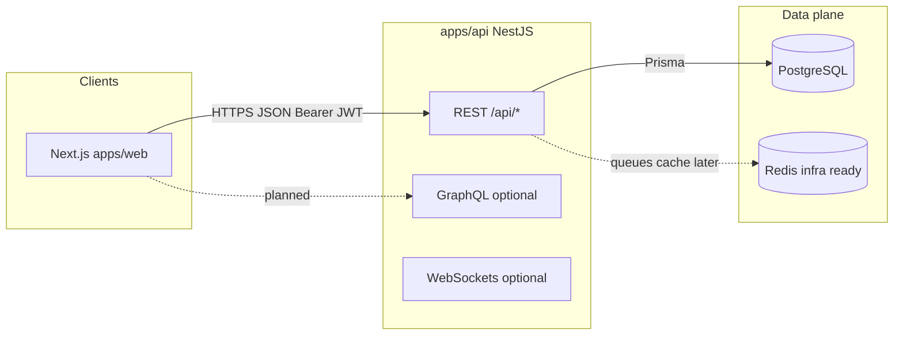
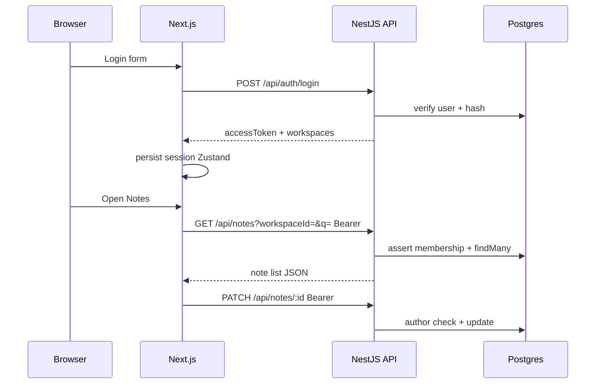

# Peblo InfinityOS

**Positioning:** An AI-powered operating system for learning, productivity, startups, collaboration, and creator economies—implemented as a **TypeScript monorepo** (Next.js + NestJS + PostgreSQL).

**Roadmap framing:** Foundation → Notes → AI → Productivity → Collaboration → Learning → Marketplace → Startup tools → Enterprise scale.

### Product vision (non-technical)

- **Personal:** notes, knowledge organization, AI assistance, learning loops.
- **Teams:** shared workspaces, planning, collaboration.
- **Creators & business:** templates, courses, CRM-style startup tools (staged).

This document is the **single source of truth** for what is implemented, how the system is structured, and what to build next. It is written for engineers and stakeholders who need **traceability** (requirement → code → gap), not marketing copy alone.

---

## 1. Executive summary (what you have today)

| Area | Status | Detail |
| --- | --- | --- |
| Monorepo & tooling | **Shipped** | npm workspaces, Docker Compose (Postgres + Redis), root scripts. |
| Auth | **Shipped (MVP)** | Email/password register & login, JWT access + refresh, `/auth/me`, Zustand session on web, route guard on dashboard. |
| Workspaces | **Shipped (MVP)** | Prisma model + memberships; `GET /workspaces/mine`; workspace switcher in shell. |
| Notes | **Partial** | JWT CRUD, TipTap + autosave, search `q` + tag filter, tags on `PATCH`, **public share** (`shareToken`, `/p/[token]`, copy link UI), no folders UI. |
| AI (note summarize) | **Shipped (MVP)** | `POST /api/ai/summarize` → OpenAI when `OPENAI_API_KEY` set, else offline demo text; persists `AiLog`; throttled; button on notes UI. |
| AI (RAG, global search, quotas) | **Not shipped** | Provider abstraction, vector store, org-wide search, billing. |
| Public share links | **Shipped (MVP)** | `Note.shareToken`, `GET /api/public/notes/:token`, `POST/DELETE /api/notes/:id/share`, web `app/p/[token]/page.tsx`. |
| Productivity (tasks) | **Shipped (MVP)** | `apps/api/src/tasks/*`, `/dashboard/tasks` | Kanban, assignee UX, workload reports |
| Productivity insights | **Not shipped** | No rollup API or analytics tiles beyond static placeholders | `GET /api/workspaces/:id/insights`, dashboards |
| Demo for visitors | **Shipped** | Prisma seed + login panel + optional `NEXT_PUBLIC_HIDE_DEMO_LOGIN`. |

**Conclusion:** Stage-1 is **materially advanced**: auth, workspaces, notes (editor + search + tags), **tasks**, **demo**, **public read-only links**, and **AI summarize** (with logging) are in place. **Not** “everything on the long roadmap”: productivity **insights**, collaboration, marketplace, enterprise controls, RAG, and billing remain future work—see §6.

---

## 2. Requirements traceability (audit)

Each row maps a product intent to implementation reality. “Evidence” points to where to extend the system.

| Requirement | State | Evidence / next step |
| --- | --- | --- |
| Secure multi-user auth | Done (MVP) | `apps/api/src/auth/*`, `apps/web/src/stores/auth-store.ts`, `dashboard-auth-gate.tsx` |
| Workspace-scoped data | Done (MVP) | `prisma/schema.prisma` (`Workspace`, `WorkspaceMember`), `workspaces/*`, `notes.service.ts` membership checks |
| Rich notes + autosave | Done (MVP) | `apps/web/src/components/notes-workspace.tsx`, `PATCH /api/notes/:id` |
| Notes search & filter | **Done (baseline)** | `GET /api/notes?workspaceId=&q=&tag=`; tags on `PATCH`; sidebar search + tag filter + editor tag field in `notes-workspace.tsx` |
| AI note summarize | **Done (MVP)** | `apps/api/src/ai/*`, `POST /api/ai/summarize`, `AiLog` writes; optional `OPENAI_API_KEY`; `notes-workspace.tsx` “AI summarize” |
| AI + search UX (global) | Not done | Dashboard search bar is placeholder; command palette / unified search service |
| Public read-only note share | **Done (MVP)** | `shareToken` migration, `public-notes.controller.ts`, `GET /api/public/notes/:token`, web `/p/[token]`, `POST/DELETE .../share` |
| Productivity insights | **Not shipped** | Tasks CRUD + `/dashboard/tasks` exist; no rollup analytics | Aggregate `Task` + `Note` metrics; `GET /api/workspaces/:id/insights` |
| Documentation | **This file** | Keep tables and diagrams updated when features ship |

### 2b. Prisma model coverage (schema ↔ product)

Each **Prisma model** is either exercised by shipping code or only reserved for future stages. This is the “kya banā / kya khālī hai” view at the **data model** level.

| Model | Schema | Backend (today) | Web UI | Gap (zakhm / missing product) |
| --- | :---: | --- | --- | --- |
| **User** | ✓ | Register, login, JWT, `/auth/me` | Auth pages, session, demo | No profile/settings API, no OAuth, no email verify |
| **Workspace** | ✓ | Created on signup; implicit in notes | Workspace switcher in shell | No rename/branding API, no `branding` JSON editor |
| **WorkspaceMember** | ✓ | Enforced in `notes.service` / auth flows | Shown indirectly via workspace list | No invites, no role change endpoints |
| **Note** | ✓ | Full CRUD + search `q`/`tag` + share + public GET | `/dashboard/notes`, `/p/[token]` | No `parentId` tree UI, `folderPath` unused in UI, `MARKDOWN` format not surfaced |
| **Task** | ✓ | `GET|POST|PATCH|DELETE /api/tasks` (JWT + workspace member) | `/dashboard/tasks` | Kanban columns, assignee picker, insights |
| **Flashcard** | ✓ | None | None | Learning module missing |
| **Quiz** | ✓ | None | None | Learning module missing |
| **AiLog** | ✓ | **Write** on `POST /api/ai/summarize` only | None | No user-facing log history, quotas, or redaction policy |
| **MarketplaceProduct** | ✓ | None | None | Marketplace missing |
| **Subscription** | ✓ | None | None | Billing / Stripe missing |
| **Notification** | ✓ | None | None | In-app notifications missing |
| **Course** | ✓ | None | None | Courses missing |
| **InvestorContact** | ✓ | None | None | Startup CRM missing |
| **AnalyticsEvent** | ✓ | None | None | Product analytics pipeline missing |

Legend: **✓** = in use as designed for current stage · **None** = table exists, no Nest route or screen wired yet.

**SaaS roadmap angle:** Stages beyond “foundation + notes + summarize + share” still rely on **empty tables** above; that is intentional schema‑first design, not a bug—each row’s “Gap” column is the backlog entry when you pick that module.

---

## 3. System architecture

### 3.1 Logical context



### 3.2 Authenticated notes flow (as implemented)



### 3.3 Repository layout (high signal)

```text
apps/web/src/
  app/                 # App Router routes (marketing, auth, dashboard)
  components/          # UI + shell (notes-workspace, dashboard-shell, …)
  lib/                 # apiUrl, api-client, demo-credentials
  stores/              # Zustand auth store + hydration

apps/api/src/
  auth/                # register, login, JWT strategy & guard
  notes/               # REST notes controller + service + DTOs
  workspaces/        # membership listing
  prisma/              # PrismaService
  …                    # GraphQL/WS modules exist; extend deliberately

apps/api/prisma/
  schema.prisma        # Canonical domain model
  seed.js              # Demo user + sample notes
```

---

## 4. Technology stack

| Layer | Technology |
| --- | --- |
| Web | Next.js 16 (App Router), TypeScript, Tailwind CSS 4, shadcn/ui, Framer Motion, Zustand, TanStack Query, TipTap, next-themes |
| API | NestJS 11, REST, GraphQL (Apollo) scaffold, WebSockets (`ws`) scaffold, JWT, class-validator, Swagger, Throttler |
| Data | PostgreSQL + Prisma 5, Redis (Compose; client usage optional) |
| AI (planned) | OpenAI / Gemini / LangChain / RAG / vector store—**not wired in `src` yet** |
| Ops | Docker Compose; deploy: Vercel (web), Railway/Render/Fly (API) |

---

## 5. Engineering standards (what “good” means here)

**Frontend**

- **Structure:** Route-level pages stay thin; interactive flows live in `components/*` (e.g. `NotesWorkspace`).
- **State:** Server state → TanStack Query (`queryKey` includes all variables that affect the response, e.g. `workspaceId`, search `q`, `tag`). Auth tokens → Zustand + persist; never duplicate token state in React context unnecessarily.
- **UX:** Loading and empty states on lists; debounced network calls for editor content; `Suspense` where `useSearchParams` is used (`auth/login`).

**Backend**

- **Structure:** One Nest module per bounded context (`AuthModule`, `NotesModule`, …). Guards at controller level for JWT.
- **Data rules:** Every notes operation checks **workspace membership**; updates additionally require **author** match (see `notes.service.ts`).
- **Evolution:** Prefer additive Prisma migrations; keep DTOs small and validated.

**Database**

- Prisma schema is the **contract** for entities. Before AI at scale, decide on `AiLog` retention, PII in prompts, and optional `pgvector` for embeddings.

---

## 6. Feature matrix (roadmap vs shipped)

| Module | Shipped in repo | Next implementation steps |
| --- | --- | --- |
| Auth + users | Register/login, JWT access + refresh, workspaces on signup, demo seed | OAuth, refresh rotation, email verify, password reset |
| Workspaces | List mine, switcher UI | Invitations, branding JSON, RBAC policies |
| Notes | JWT REST, TipTap + autosave, search `q`, filter `tag`, tags, **public share** (`/p/[token]`) | Folders UI, collaboration |
| AI OS | **Summarize MVP** (`POST /api/ai/summarize`), `AiLog` persistence | RAG, quotas, model routing, redaction |
| Productivity | **Tasks MVP** (CRUD + list UI) | Kanban columns, calendar, insights endpoints |
| Collaboration | `ws` ping/pong | Yjs + TipTap presence |
| Learning / Marketplace / Enterprise | Schema hooks | Per staged roadmap |

---

## 7. Local setup

**Prerequisites:** Node 20+, npm 10+, Docker (for Postgres/Redis).

1. **Clone and install**

   ```bash
   npm install
   ```

2. **Environment**

   Copy `.env.example` to:

   - `apps/api/.env` — `DATABASE_URL`, `JWT_ACCESS_SECRET`, `JWT_REFRESH_SECRET`, optional `WEB_ORIGIN`, optional `DEMO_*` for the seeded demo user.
   - `apps/web/.env.local` — `NEXT_PUBLIC_API_URL=http://localhost:4000`. Optional: `NEXT_PUBLIC_DEMO_EMAIL` / `NEXT_PUBLIC_DEMO_PASSWORD` (must match seed if overridden).

3. **Start databases**

   ```bash
   npm run docker:up
   ```

4. **Migrate database**

   ```bash
   cd apps/api
   npx prisma migrate deploy
   npx prisma generate
   ```

5. **Seed the shared demo account**

   From repo root:

   ```bash
   npm run db:seed
   ```

   Or from `apps/api`: `npx prisma db seed`. Re-running updates the demo password from `DEMO_PASSWORD` and ensures sample notes.

6. **Run apps**

   ```bash
   # terminal A
   npm run dev:api

   # terminal B
   npm run dev:web
   ```

**URLs**

- Web: `http://localhost:3000`
- Public note (after creating a link): `http://localhost:3000/p/<shareToken>`
- API: `http://localhost:4000/api`
- Swagger: `http://localhost:4000/docs` (verify mount path in your Nest bootstrap if 404).

---

## 8. API documentation (REST highlights)

- `GET /api/health` — liveness.
- `POST /api/auth/register` — `{ email, password, name? }` → user + workspace + tokens.
- `POST /api/auth/login` — `{ email, password }` → tokens.
- `GET /api/auth/me` — Bearer: user + workspaces.
- `GET /api/workspaces/mine` — Bearer: memberships.
- `GET /api/notes?workspaceId=<id>&q=<text>&tag=<exact>` — Bearer: list notes; `q` searches **title and content** (case-insensitive); `tag` filters notes **containing** that exact tag (array `has`).
- `GET /api/notes/:id` — Bearer: full note.
- `POST /api/notes?workspaceId=<id>` — Bearer: create.
- `PATCH /api/notes/:id` — Bearer: author-only `title` / `content` / `tags` (replaces tag array, max 20).
- `POST /api/notes/:id/share` — Bearer (author): create or return `shareToken`; body `{ regenerate?: boolean }`.
- `DELETE /api/notes/:id/share` — Bearer (author): revoke public link.
- `POST /api/ai/summarize` — Bearer `{ noteId }` → `{ summary, model, tokensUsed }` and `AiLog` row; OpenAI `gpt-4o-mini` when `OPENAI_API_KEY` is set.
- `GET /api/public/notes/:token` — **no auth**, read-only `{ title, content, format, updatedAt }` (rate limited).
- `GET /api/tasks?workspaceId=<id>` — Bearer: list tasks (workspace member).
- `GET /api/tasks/:id` — Bearer: one task.
- `POST /api/tasks?workspaceId=<id>` — Bearer: create task.
- `PATCH /api/tasks/:id` — Bearer: update task (any member of workspace).
- `DELETE /api/tasks/:id` — Bearer: delete task.

---

## 9. Deployment

| App | Suggested host | Notes |
| --- | --- | --- |
| `apps/web` | Vercel | Set `NEXT_PUBLIC_API_URL` to the public API URL. |
| `apps/api` | Railway / Render / Fly | `DATABASE_URL`, JWT secrets, `WEB_ORIGIN`, optional `OPENAI_API_KEY` for live AI. Release: `prisma migrate deploy`, `prisma generate`, then `prisma db seed` once (or per policy). |
| Postgres / Redis | Managed or Docker | Match connection strings to Prisma. |

---

## 10. Screenshots & demo

After seeding, use credentials on `/auth/login` (defaults in `.env.example`). **Demo** header button → `/auth/login?demo=1` pre-fills the form. Set `NEXT_PUBLIC_HIDE_DEMO_LOGIN=1` to hide the demo panel in production while keeping seeded accounts for private testing.

---

## 11. Roadmap (stages)

1. **Stage 1 — MVP:** Auth, notes (in progress: sharing + AI next), search, dashboard shell.
2. **Stage 2 — Advanced:** Flashcards, quizzes, collaboration, startup tools.
3. **Stage 3 — Premium:** Marketplace, enterprise controls, mobile clients.

### Monetization (product context)

- SaaS tiers (free → team → enterprise), usage-metered AI credits, marketplace revenue share, optional white-label. *Billing integrations are not implemented in this repo yet.*

---

## 12. Scripts (root)

| Script | Purpose |
| --- | --- |
| `npm run dev:web` | Next.js dev server |
| `npm run dev:api` | NestJS watch mode |
| `npm run build` | Production builds for web + api |
| `npm run docker:up` / `docker:down` | Postgres + Redis |
| `npm run db:seed` | Demo user + sample notes |

---

## 13. Troubleshooting

- **Next.js lockfile / SWC / `ENOWORKSPACES` / `spawnSync cmd.exe ENOENT`:** Known noise under some npm workspace + Windows setups; builds often still finish. Mitigations: run `npm run build` from `apps/web`, ensure `cmd.exe` is on `PATH`, or adjust Next patch version per upstream fixes.
- **Prisma `EPERM` on `prisma generate`:** Close processes locking `query_engine-windows.dll.node`, or run terminal as admin once—Windows file locking issue, not application logic.

---

Private / UNLICENSED by default—set SPDX license in each package when you open-source or commercialize.
